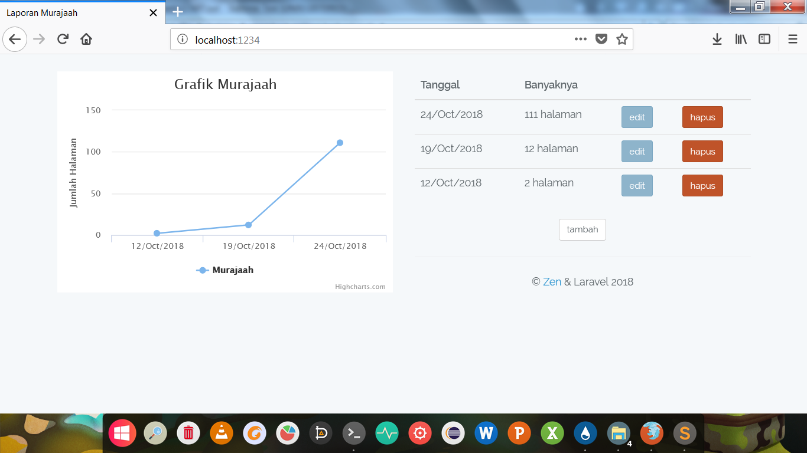

# Instalasi

Buat folder `www/` dan letakkan proyek Laravel di dalamnya.

# Perhatian

Untuk database, menggunakan SQLite.

# Custom

Untuk mengubah port, buka `START.bat` lalu ubah pada bagian:

```batch
set port=1234
```